<p align="center">
  
  
  
  
  
  
  
  
  
</p>

<h2 align="center">InsGallery</h1>

<p align="center">
  <b>Instagram-like image picker for Android (一款 UI 炫酷高仿 Instagram 的图片、视频选择器)</b>
</p>

<p align="center">
  <a href="https://github.com/LuckSiege/PictureSelector">
    <b>Powered by PictureSelector</b>
  </a>
</p>

<p align="center">
  <a href="https://gitee.com/JessYanCoding/InsGallery">
    <b>国内仓库</b>
  </a>
</p>

<p align="center">
  <a href="https://github.com/JessYanCoding/InsGallery/raw/master/apk/v0.7.0_2020_08_04.apk">
    <b>APK</b>
  </a>
</p>

<p align="center">
⇣
</p>

<p>
  
  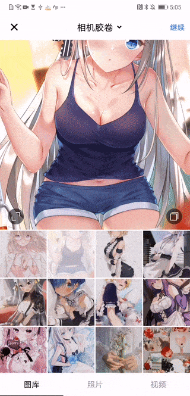
  
</p>

## Download
``` gradle
 implementation 'me.jessyan:insgallery:0.7.0'
```

## Usage
```java
InsGallery.openGallery(Activity, GlideEngine.createGlideEngine(), new OnResultCallbackListenerImpl(mAdapter));
```

## Overview
### Feature
<p>
   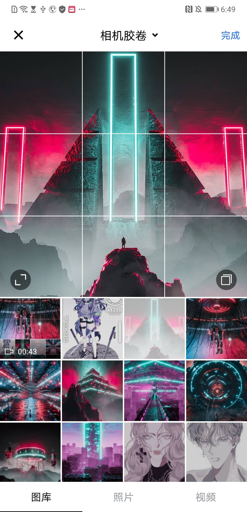
   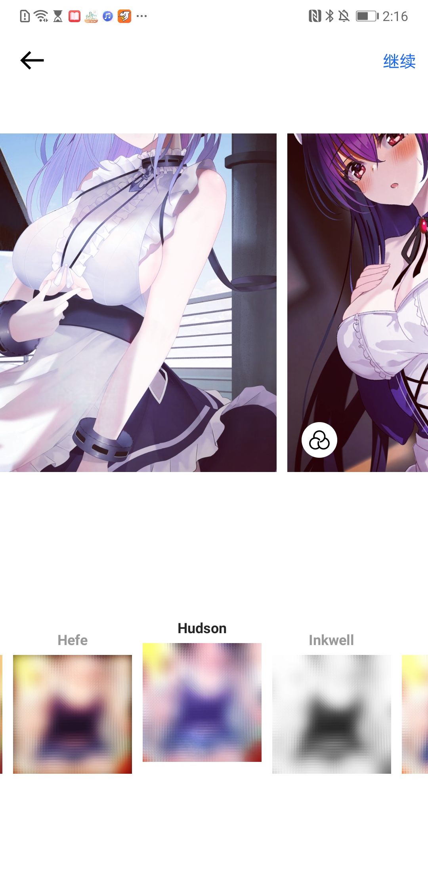
   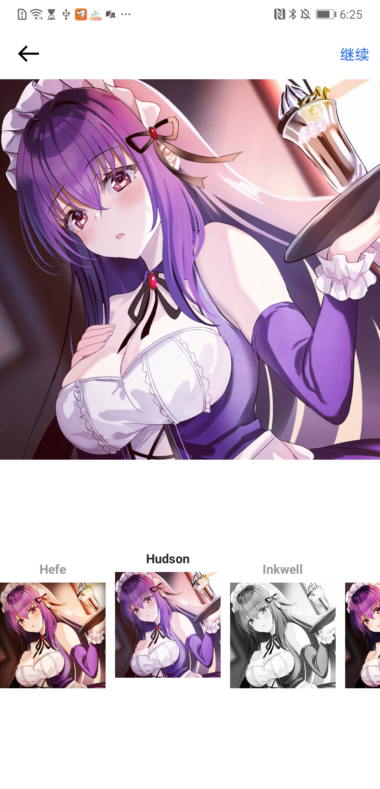
</p>

<p>
   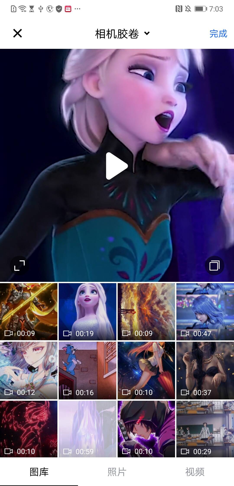
   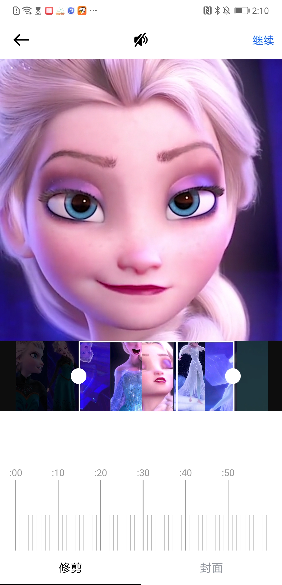
   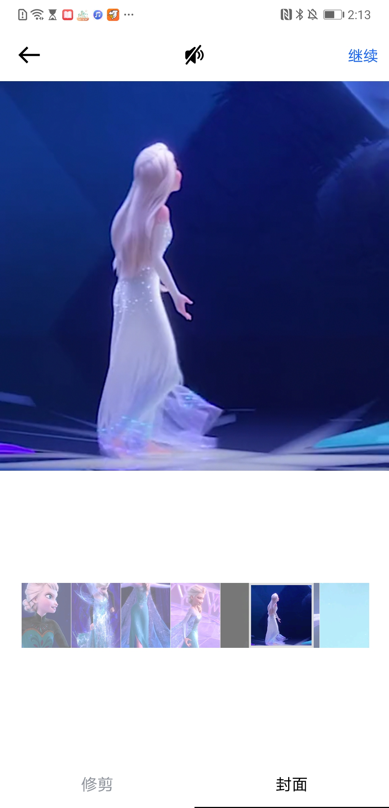
</p>

### Default Style
<p>
   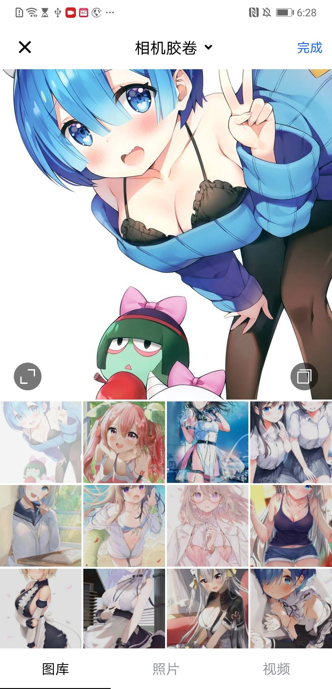
   
   
</p>

### Dark Style
<p>
   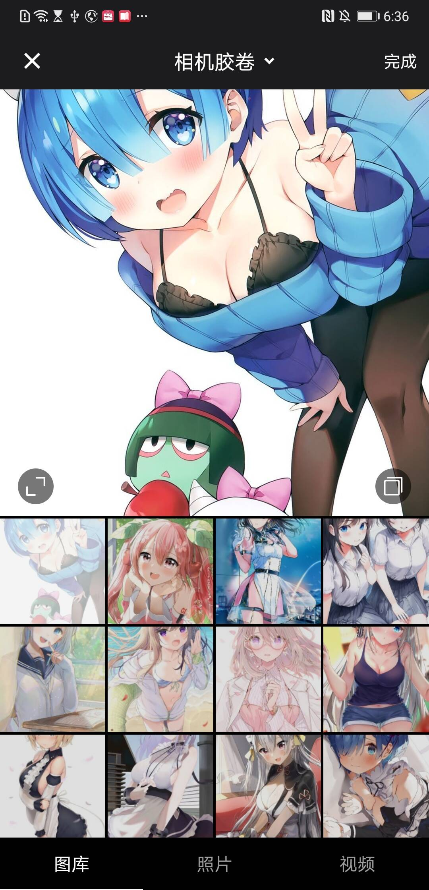
   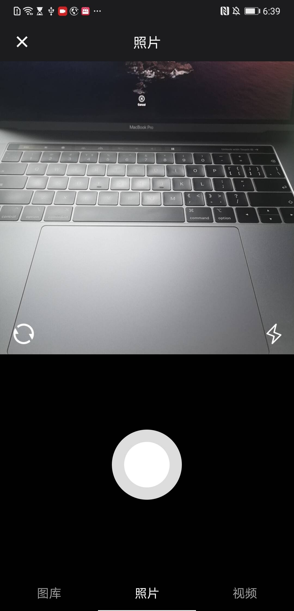
   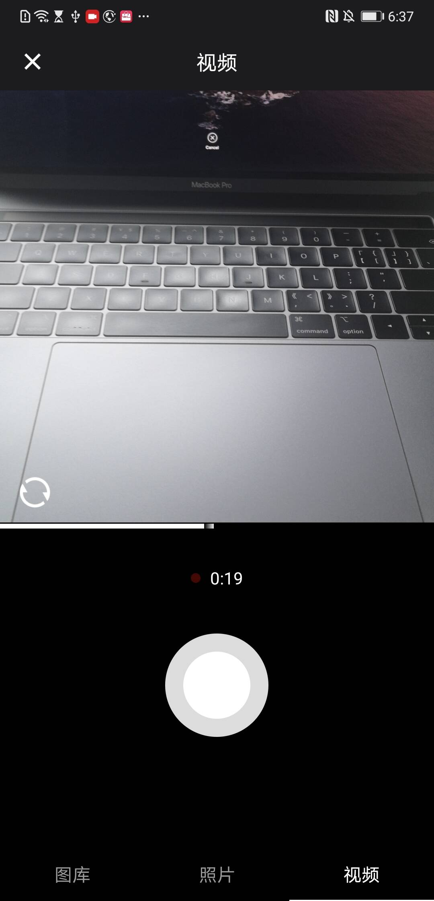
</p>

### Dark Blue Style
<p>
   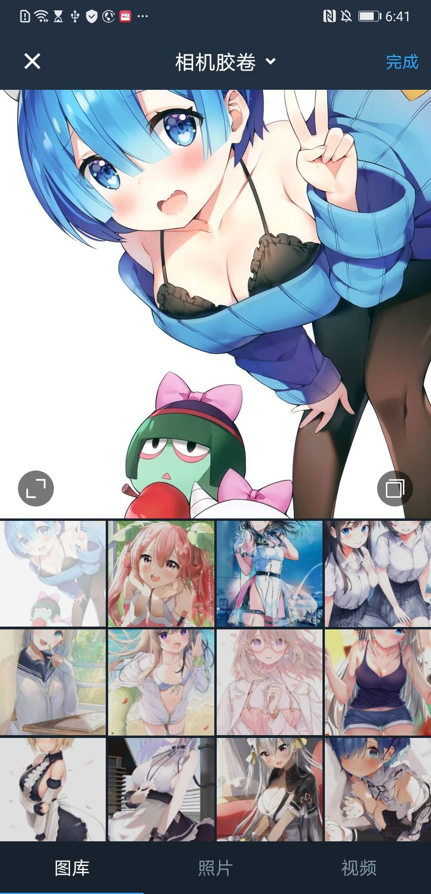
   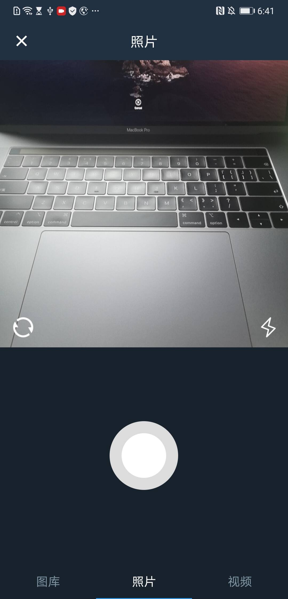
   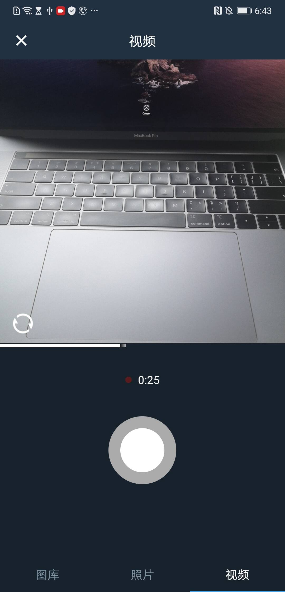
</p>

  
 ## About Me
 * **微信公众号**: **JessYan**
 * **Email**: <jess.yan.effort@gmail.com>
 * **Home**: <http://jessyan.me>
 * **掘金**: <https://juejin.im/user/57a9dbd9165abd0061714613>
 * **简书**: <https://www.jianshu.com/u/1d0c0bc634db>

 ## License
 ```
  Copyright 2020, JessYan

    Licensed under the Apache License, Version 2.0 (the "License");
    you may not use this file except in compliance with the License.
    You may obtain a copy of the License at

        http://www.apache.org/licenses/LICENSE-2.0

    Unless required by applicable law or agreed to in writing, software
    distributed under the License is distributed on an "AS IS" BASIS,
    WITHOUT WARRANTIES OR CONDITIONS OF ANY KIND, either express or implied.
    See the License for the specific language governing permissions and
    limitations under the License.
 ```

